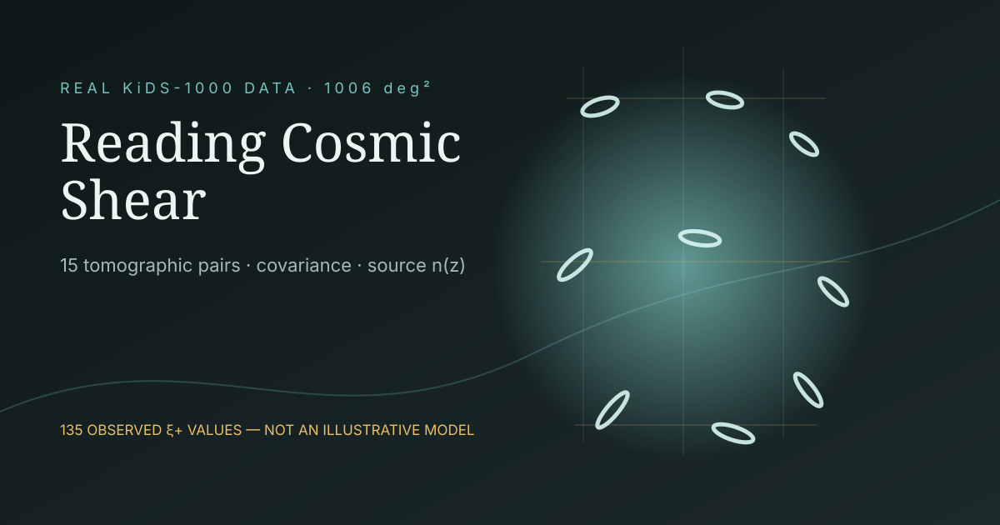

# Reading Cosmic Shear: a KiDS-1000 Data Laboratory



An evidence-first browser laboratory built from the official KiDS-1000 cosmic-shear two-point-correlation release. It replaces the repository's earlier illustrative slider model with observed `xi_plus` vectors, released covariance blocks and measured source-redshift distributions.

**[Open the live laboratory](https://biswajit1999.github.io/cosmic-shear-tomography-lab/)**

## Research question

How does the evidence for correlated galaxy shapes change as the source population moves to greater redshift?

The page compares all 15 tomographic bin pairs from the KiDS-1000 `xiP` FITS extension. Three guided views—nearby×nearby, nearby×distant and distant×distant—make the underlying lensing geometry understandable before exposing the complete pair selector.

## Result reproduced by this repository

For each selected pair, the repository tests the transparent null vector `xi_plus = 0` using the released 9×9 covariance block:

```text
chi2 = d^T C^-1 d
correlated_distance = sqrt(chi2)
p = P(ChiSquare_9 >= chi2)
```

For example, the released bin 5×5 vector has a correlated distance of approximately `13.53` and a zero-shear-null p-value near `1.1e-34`; bin 1×1 alone has distance `3.42` and p≈`0.23`. This is a null-vector diagnostic, not a cosmological parameter fit or an independent reproduction of the KiDS S8 posterior.

## Data lineage

- Release: [KiDS-1000 cosmic-shear data products](https://kids.strw.leidenuniv.nl/DR4/KiDS-1000_cosmicshear.php)
- Source file: `xipm_KIDS1000_..._Fid.fits`, copied without modification to `research/source/kids_xipm.fits`
- Source archive SHA-256: `97729199aeb23238767921f58f36341317aa5251beab99e2575eb35fe78c7bb3`
- FITS SHA-256: `466d1d761fedac02e53b5468cdbab20f622c2f04b830085cccdae5b629ebe66c`
- Browser derivative: `data/kids1000-xip.json`
- Derivation: `python scripts/derive_kids1000.py`

The browser JSON preserves 15 pairs × 9 angular bins, diagonal errors, each full within-pair covariance block, and the normalized redshift distributions for all five source bins.

## Reproduce

```bash
python -m pip install -r requirements-research.txt
python scripts/derive_kids1000.py
npm run check
python -m http.server 8080
```

The committed FITS file is sufficient to reproduce the browser derivative without a network request. The original 17 MB release archive is not duplicated in Git; its official URL and checksum are recorded in both the derivation script and output metadata.

## Scope and limitations

This project directly visualizes observed KiDS-1000 correlation data. It does not implement the Limber projection, nonlinear matter power spectrum, photometric-redshift nuisance model, intrinsic-alignment likelihood, scale cuts, or the complete KiDS cosmology pipeline. Consequently it does not infer `Omega_m`, `sigma8`, or `S8`.

The per-pair null calculation uses the complete covariance among the nine angular values for that pair. It does not include covariance with the remaining tomographic pairs, so the per-pair p-values must not be combined as though independent.

## Citation

Asgari, M. et al. (2021), “KiDS-1000 Cosmology: Cosmic shear constraints and comparison between two point statistics,” *Astronomy & Astrophysics*, 645, A104. [DOI: 10.1051/0004-6361/202039070](https://doi.org/10.1051/0004-6361/202039070)

Based on observations made with ESO Telescopes at the La Silla Paranal Observatory under programme IDs 177.A-3016, 177.A-3017, 177.A-3018 and 179.A-2004, and on data products produced by the KiDS consortium.
